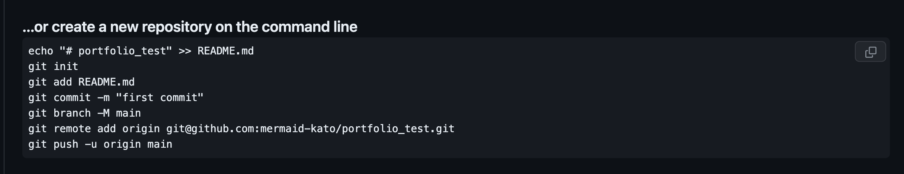

## githubにアップするまで

### 1. Homebrewをインストール

今のMacにデフォルトで入ってるかわからないので、一応記載

https://brew.sh/ja を参考にインストールを行う

※ HomebrewとはmacOS（またはLinux）用のパッケージマネージャー。RubyやGithubなどをインストールしてくれる便利なやつ

### 2. Gitをインストール

```shell
% brew install git

# GitがPC上に存在するか確認しよう
% which git
```

#### whichでGitがなかったら...

https://zenn.dev/inablog/articles/25f6ac101d0b45 を参考にパスを通す

### 3. アカウントを作成
https://github.com からアカウントを作成する

### 4. リポジトリを新規作成
Newボタンを押下


Repository nameに適当なリポジトリ名

Public or Private を選択（全世界に公開するならPublicかな）


create repositoryを押下

### 5. push

以下を参考にpushしたいファイルに対して `git init` を実行（そうすることでいつものgit コマンドが実行可能！）


`git commit`でcommitを作成して、pushを行う

そうすることでファイルがアップされているはず！！
